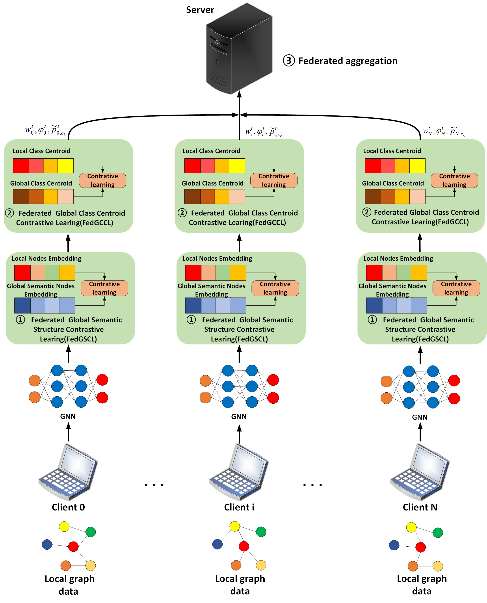

# FedGSDA
In real-world scenarios, graph data is often dispersed across various institutions, and collaborative training via federated graph learning emerges as a potent strategy for aggregating insights from diverse sources. While most existing research focuses on mitigating discrepancies in model parameters, this study takes a novel perspective, addressing challenges stemming from graph structure and node attribute distribution. Our approach, termed Federated Graph Learning with Structure and Node Distribution Augmentation under Non-IID Scenarios (FedGSDA), aims to amalgamate global insights into local models through contrastive learning, thereby bridging the gap between local and global distributions. Experimentation across four social datasets validates the efficacy of FedGSDA, achieving accuracies of 0.873, 0.704, 0.585, and 0.894, surpassing benchmarks like FedGCN. Ablation experiments from a structural standpoint effectively integrate global information into local models, while focusing on node attribute distribution reveals the benefits of contrasting intra-class nodes and inter-class centroids for improved class separability. Additionally, comparative evaluations of different federated learning algorithms under multi-client settings underscore the scalability of FedGSDA.

# Framework

# DataSet
The experimental dataset includes Cora[1], BlogCatalog[2], Flickr[2] and Facebook[3], you can download it yourself on the Internet.

# Experimental environment
+ torch == 2.2.2
+ pandas == 1.22.0
+ networkx == 3.1
+ matplotlib == 3.7.1
+ numpy == 1.22.0

# Reference
-[1] A. K. McCallum, K. Nigam, J. Rennie, and K. Seymore, “Automating the construction of internet portals with machine learning,” Information Retrieval, vol. 3, pp. 127–163, 2000.
-[2] L. Tang and H. Liu, “Relational learning via latent social dimensions,” in Proceedings of the 15th ACM SIGKDD international conference on Knowledge discovery and data mining, 2009, pp. 817–826.
-[3] B. Viswanath, A. Mislove, M. Cha, and K. P. Gummadi, “On the evolution of user interaction in facebook,” in Proceedings of the 2nd ACM workshop on Online social networks, 2009, pp. 37–42.

